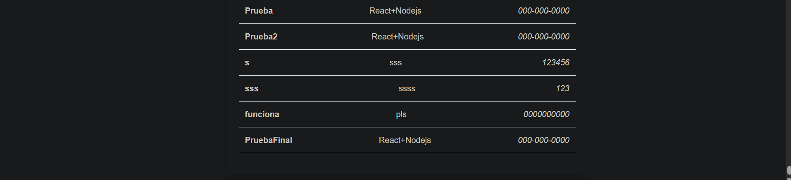

# Agenda Multicapas React

Esta es la tarea #5 de Enmanuel Guerrero Santana (2024-0275). A continuación la captura de pantalla:

A diferencia de proyectos anteriores, en esta tarea integro la carpeta server que define el servidor interno Express usando Node.js para hacer los endpoints para listar y almacenar contactos.

Mantengo el mismo apartado visual que en las dos tareas anteriores ya que no era un requisito.